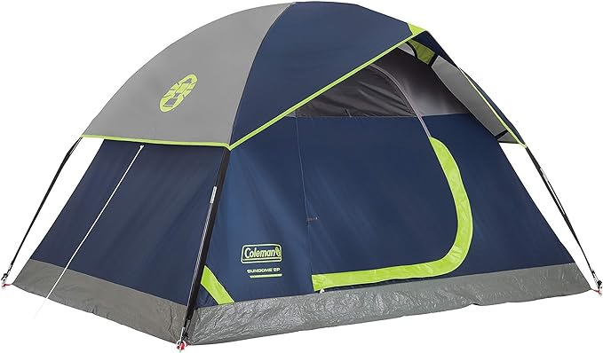

# Inpainting

## Overview

https://github.com/nityanandmathur/Inpainting/assets/77379835/9900ff04-52f2-4247-a28d-34aeb33deb8c


## Text-driven impainting

### Inpainting
1. The input image is enlarged to provide more room for the inpainting process. However, this step can be overlooked if the input image does not feature a close-up view of the object.

2. A mask is created for the input image. Given that the input images have a white background, the object is concealed with a black mask, leaving the background unaffected.

3. The input image, mask and text prompt are passed to the inpainting model `"stabilityai/stable-diffusion-2-inpainting"` using Hugging Face `diffusers`.

### Video Generation
1. The inpainted images, originally of size `512 X 512`, are expanded by adding `50` pixels in all four directions. This results in an image of size `562 X 562`, which is subsequently resized back to `512 X 512`.

2. The resized image is then masked.

3. The masked image, along with a text prompt, undergoes an inpainting process.

4. This entire procedure is repeated iteratively to generate a sequence of 9 images, thereby creating a zooming-out effect.

| Input Image | Inpainted Image | Video |
|:-----------:|:---------------:|:-----:|
|  |  | |
<p align="center"><em>Product in a kitchen used in meal preparation</em></p>

| | | |
|:-----------:|:---------------:|:-----:|
||  |  |
<p align="center"><em>Bicycle on a street</em></p>

| | | |
|:-----------:|:---------------:|:-----:|
||  |  |
<p align="center"><em>Toaster placed on kitchen stand</em></p>

| | | |
|:-----------:|:---------------:|:-----:|
||  |  |
<p align="center"><em>Chair behind a table in a study room</em></p>

| | | |
|:-----------:|:---------------:|:-----:|
| |  |  |
<p align="center"><em>Tent in a forest</em></p>

| | | |
|:-----------:|:---------------:|:-----:|
| |  |  |
<p align="center"><em>A bottle of whisky on stand of a bar</em></p>

### Failure cases
The model fails to inpaint images involving humans.

|Input Image | Inpainted image |
|:-----------:|:---------------:|
| |  |
<p align="center"><em>Person standing in a hall meeting people</em></p>

|||
|:-----------:|:---------------:|
| |  |
<p align="center"><em>Person standing in a hall meeting people</em></p>


## Installation
### Conda
```bash
conda env create -f inpainting.yml
```
### Alternative
```
conda create -n impainting python=3.11

conda install pytorch==2.1.1 torchvision==0.16.1 torchaudio==2.1.1 pytorch-cuda=11.8 -c pytorch -c nvidia

pip install diffusers

pip install transformers

pip install opencv-python
```

## Inpainting
```bash
cd src
python main.py --prompt "<your text prompt>" --image_path "<path to your image>" --upscale True
```

By default, the `upscale` parameter is set to `False`. This is used for images where the main object occupies a large portion of the image. The purpose of setting upscale to `True` is to reduce the size of the main object, thereby improving the inpainting process

## Video Generation
Use the inpainted image to generate a zooming-out video.

1. `video.py` generates frames for the video
2. `render.py`generates GIF from frames. You can play with `duration` to change smoothness of videos. 

```bash
cd src
python video.py --prompt "<your text prompt>" --image_path "<path to inpainted image>"

python render.py --path "<path to folder containing generated frames>"
```
For the experiments, the `prompts` used for video generation were same to those used during the inpainting process.

<hr>

## References

If you find this work useful, please cite:

```bibtex
@InProceedings{Rombach_2022_CVPR,
    author    = {Rombach, Robin and Blattmann, Andreas and Lorenz, Dominik and Esser, Patrick and Ommer, Bj\"orn},
    title     = {High-Resolution Image Synthesis With Latent Diffusion Models},
    booktitle = {Proceedings of the IEEE/CVF Conference on Computer Vision and Pattern Recognition (CVPR)},
    month     = {June},
    year      = {2022},
    pages     = {10684-10695}
}

```